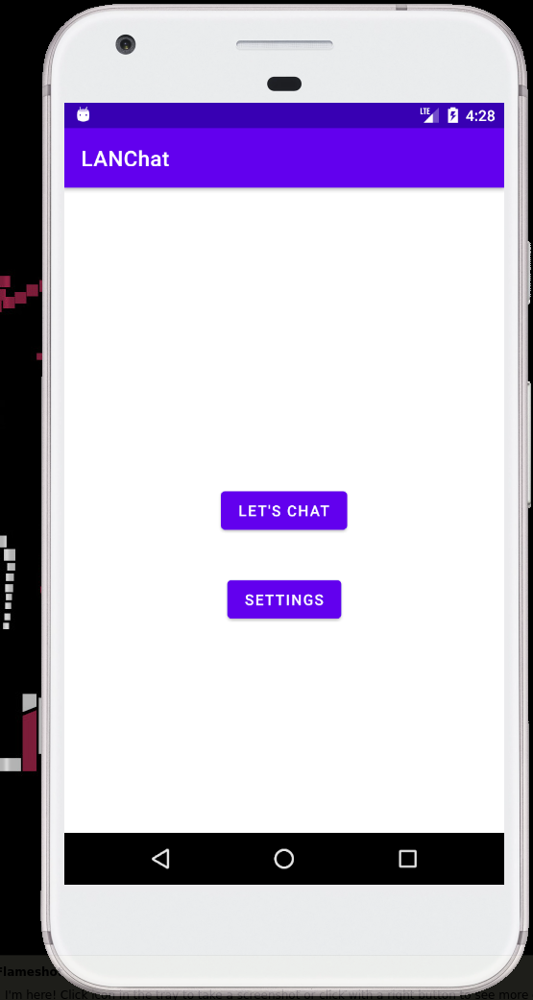
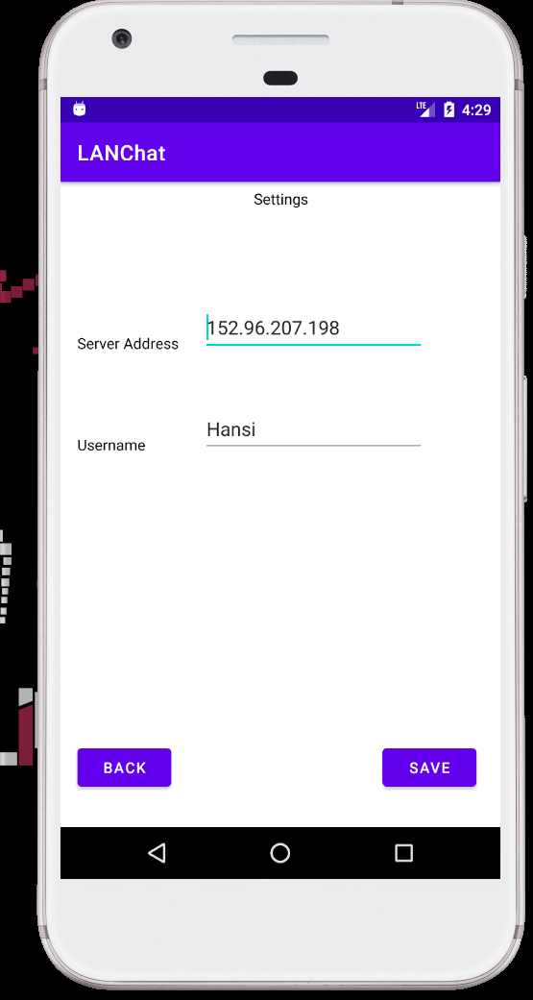
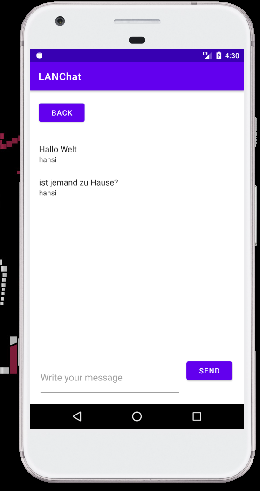
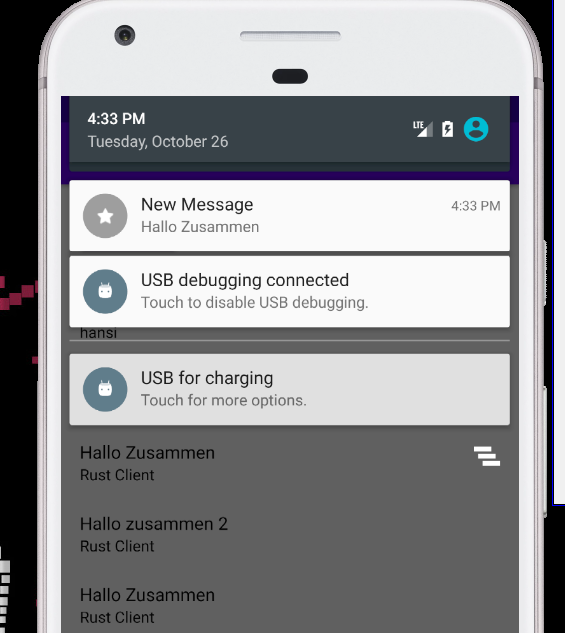

# mge
MGE Miniproject

Ein LAN Messanger App, welche über Websockets mit einem Server spricht. Um den Fokus auf die Entwicklung der App zu legen, habe ich mich entschieden, als Server ein Echo-Server auf Websockets-Basis zu verwenden. Dadurch kann die App mit einem Server kommunizieren und erhält aber auch eine Nachricht zurück.

- WebSocketServer: [ws-echo-server](https://github.com/sunny-zuo/ws-echo-server)
- WebSocketLibrary: [Java-Websocket](https://github.com/TooTallNate/Java-WebSocket)
- JSON Serialisierung: [Gson](https://github.com/google/gson)

## Punkteverteilung
Features 
- [X] Verwendung von Kotlin statt Java
- [X] Verwendung von Notifications
- [X] Verwendung von Actoren (Vibration)
- [X] Verwendung von Drittkomponenten (Websockets und Gson)
- [X] Persistenz (Speichern von Settings)

Implementierung:
- [X] Observer Pattern für Notification / Rendering, wenn neue Nachricht erhalten

## Images
Start Actvity 

Settings Activity

Chat Activity

Notification

